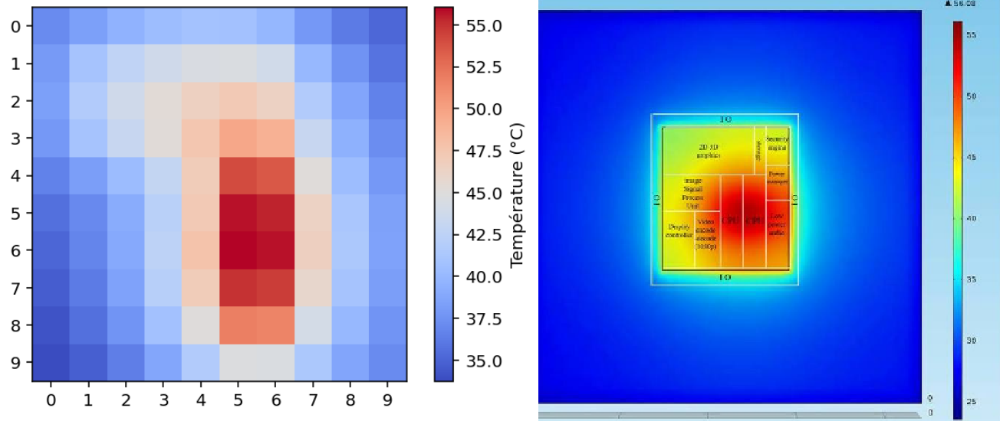
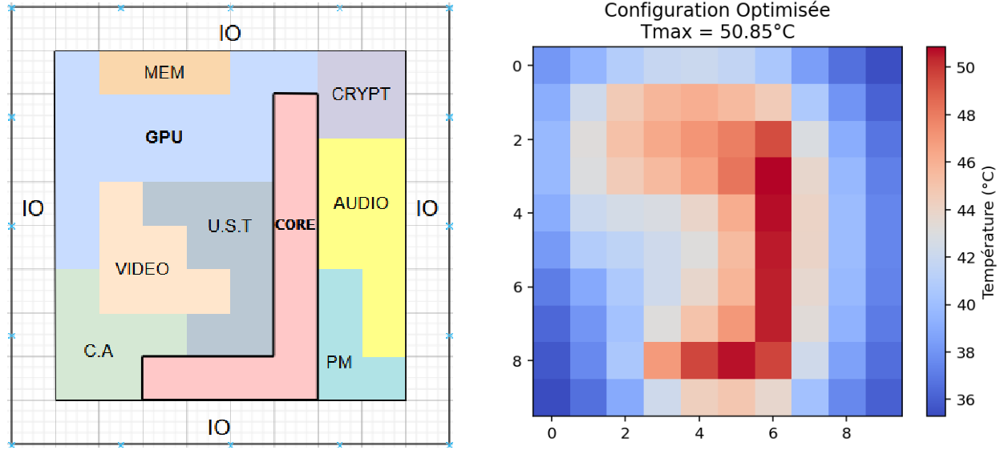

# CPU Thermal Diffusion and Geometric Optimization

## Overview

Modern CPUs dissipate high thermal power densities, leading to the formation of hotspots that negatively impact performance and reliability. Efficient thermal management is therefore critical to maintain computational efficiency while minimizing cooling costs.

This project investigates the modeling and optimization of heat diffusion within a CPU die. The objective is to simulate temperature distribution, analyze hotspot formation, and optimize geometric configurations to improve thermal dissipation.

The model was applied to a test architecture inspired by the **Intel Atom D2700**, using a simplified spatial discretization (mesh) to ensure computational efficiency. The framework, however, is modular and can be extended to finer meshes and more complex architectures.

This work was developed as part of a TIPE (CPGE research project).

---

## Problem Statement

How can thermal diffusion within a CPU be modeled and optimized in order to:

- Limit the formation of hotspots,
- Prevent performance degradation,
- Improve overall thermal efficiency?

What numerical models and optimization methods allow for a more homogeneous temperature distribution under realistic CPU constraints?

---

## Methodology

### 1. Thermal Modeling

The CPU die is discretized into a 2D thermal grid (thermal RC network model):

- Each cell is modeled as a thermal capacitance,
- Neighbor interactions are modeled via thermal resistances.

The heat transfer process is governed by the heat equation.

For computational efficiency, a simplified mesh was implemented for the Intel Atom D2700 test case. The discretization can be refined to increase spatial resolution or adapted to different processor geometries.

---

### 2. Numerical Resolution

Two main numerical approaches were implemented:

- **Crank–Nicolson scheme** for transient heat diffusion  
- **Conjugate Gradient method** for solving the linear systems arising from spatial discretization in steady-state regimes  

The implementation focuses on numerical stability, convergence, and computational cost.

---

### 3. Thermal Analysis

The simulation enables:

- Identification of hotspot regions
- Evaluation of peak temperatures
- Analysis of thermal gradients
- Comparison between different geometric configurations

---

### 4. Geometric Optimization

The spatial layout of functional blocks was modified in order to:

- Reduce maximum temperature,
- Minimize temperature gradients,
- Improve overall heat spreading.

The optimization framework is compatible with more detailed geometrical models.

---

## Results

### Simulated Thermal Map

### Optimized Configuration

---

## Key Concepts

- Heat equation
- Thermal RC modeling
- Numerical discretization
- Crank–Nicolson scheme
- Conjugate Gradient method
- Hotspot analysis
- Geometric thermal optimization

---

## References

- Skadron et al., *HotSpot: A Compact Thermal Modeling Methodology*
- Crank & Nicolson, *Numerical Evaluation of Heat-Conduction Equations*
- Hestenes & Stiefel, *Methods of Conjugate Gradients for Solving Linear Systems*

